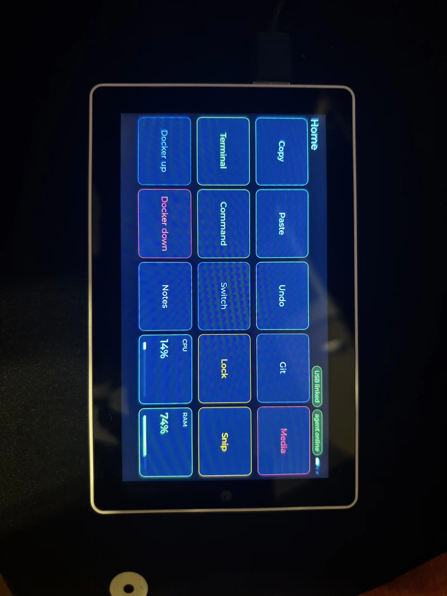
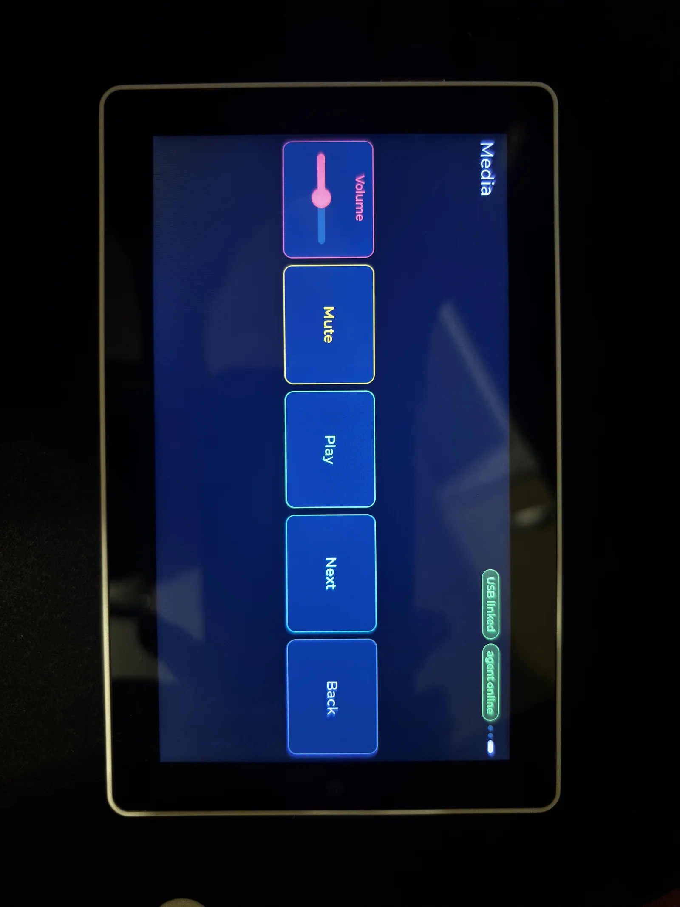
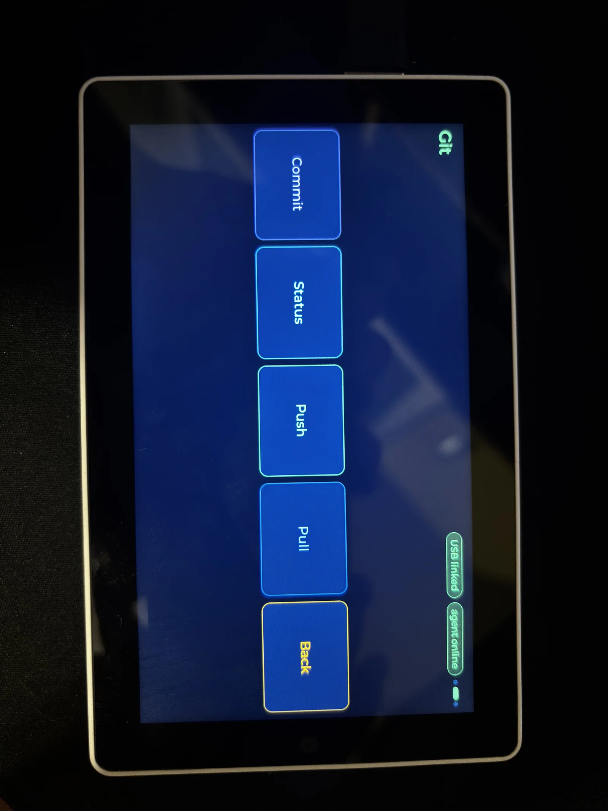

# Tab5 Touch Deck

Програмируем USB macro pad за **M5Stack Tab5 (ESP32-P4 + ESP32-C6)**. Сензорният екран изпраща клавишни комбинации и медийни команди към компютър. Допълнителен Python агент изпълнява предварително разрешени локални команди и връща CPU/RAM/disk телеметрия.

ESP32-P4 изпълнява приложението. ESP32-C6, Wi-Fi и Bluetooth не се използват. Не са необходими облак или API ключове; малък локален HTTP сървър се ползва само ако отворите визуалния редактор.

## Основни функции

- LVGL landscape интерфейс 1280×720 с асиметрични JSON layouts, икони, подсказки и telemetry tiles.
- USB клавиатура и consumer control без агент; ASCII текст и кратки макроси.
- Python агент с whitelist от имена към конкретни `argv` команди.
- Home, Work, Media и System страници с долна навигация; автоматично превключване по window title под Windows.
- Локален визуален редактор с preview, Inspector, drag-and-drop и JSON export.
- Относителен volume slider, звуков feedback, BMI270 жестове и затъмняване.
- SPIFFS конфигурация и прехвърляне на JSON по raw HID без firmware flash.

**Състояние:** прототип с исторически успешни build/boot/agent логове, известни дефекти и непокрити хардуерни тестове. Upload **не е атомарен при загуба на захранване**. Виж [CURRENT_STATE](docs/CURRENT_STATE.md).

## Hardware

Tab5, USB-C **кабел за данни** и компютър. Използват се дисплей, touch, PSRAM/flash, говорител/ES8388 и BMI270. За runtime UART диагностика може да трябва отделен USB–UART адаптер; проверената схема още липсва. [HARDWARE](docs/HARDWARE.md).

## Software stack

ESP-IDF **5.5.5**, C/CMake/Ninja/FreeRTOS, локално модифициран BSP 1.3.0, LVGL 9.5.0, `esp_tinyusb` 1.7.6~2 и TinyUSB 0.21.0~1 в наличния dependency snapshot. Host: Python **3.11+**, `hidapi>=0.14.0`, `psutil>=6.0.0`. Няма Arduino, PlatformIO или Node.js. [SOFTWARE](docs/SOFTWARE.md).

## Screenshots





## Quick Start

Изпълнете [SETUP](docs/SETUP.md) за Git, ESP-IDF 5.5.5 и Python. Командите са за PowerShell:

```powershell
git clone --recurse-submodules https://github.com/Penk0vXd/m5stack-tab5-touch-deck.git tab5-touch-deck
cd tab5-touch-deck
python -m venv .venv
.\.venv\Scripts\python.exe -m pip install -r host-agent\requirements.txt
Copy-Item host-agent\config.example.toml host-agent\config.toml
notepad host-agent\config.toml
scripts\editor.bat
```

Скриптът отваря `http://127.0.0.1:8080/editor/`. Редактирайте визуално и
свалете `config.json`. За директен upload без firmware rebuild:

```powershell
.\.venv\Scripts\python.exe host-agent\agent.py --push-config storage\config.json
```

Попълнете реалните `cwd` и разрешени команди. Прочетете [USAGE](docs/USAGE.md) преди Git или project действия. В **ESP-IDF 5.5.5 PowerShell** от корена:

```powershell
cd firmware
idf.py set-target esp32p4
idf.py build
python -m serial.tools.list_ports -v
# COM5 е пример: заменете с действителния download port.
idf.py -p COM5 flash
```

За download mode задръжте Reset около 2 секунди до бързо мигане на зеления LED и отпуснете — [официална процедура](https://docs.m5stack.com/en/guide/restore_factory/m5tab5). След flash устройството стартира автоматично. В отделен PowerShell от корена:

```powershell
.\.venv\Scripts\python.exe host-agent\agent.py
```

Очаквайте `USB linked` и след telemetry `agent online`. Runtime firmware няма USB CDC serial console. [Build, monitor и recovery](docs/BUILD_AND_FLASH.md).

## Documentation

| Документ | Съдържание |
|---|---|
| [Индекс](docs/README.md) | Пътища за нов потребител и разработчик |
| [PROJECT_OVERVIEW](docs/PROJECT_OVERVIEW.md) | Цел и workflow |
| [CURRENT_STATE](docs/CURRENT_STATE.md) | Working / Partial / Missing / Issues / Testing |
| [HARDWARE](docs/HARDWARE.md) | Компоненти и връзки |
| [SOFTWARE](docs/SOFTWARE.md) | Stack и зависимости |
| [ARCHITECTURE](docs/ARCHITECTURE.md) | Модули, задачи и потоци |
| [PROJECT_STRUCTURE](docs/PROJECT_STRUCTURE.md) | Карта на файловете |
| [SETUP](docs/SETUP.md) | Среда от чист компютър |
| [BUILD_AND_FLASH](docs/BUILD_AND_FLASH.md) | Build, flash, monitor, recovery |
| [CONFIGURATION](docs/CONFIGURATION.md) | JSON, TOML и Kconfig |
| [USAGE](docs/USAGE.md) | Екрани и действия |
| [DEVELOPMENT](docs/DEVELOPMENT.md) | Разработка и testing |
| [TROUBLESHOOTING](docs/TROUBLESHOOTING.md) | Диагностика |
| [IMAGES](docs/IMAGES.md) | План за реални снимки |
| [ROADMAP](docs/ROADMAP.md) | Бъдещо развитие |
| [CHANGELOG](docs/CHANGELOG.md) | Промени |
| [SECURITY](docs/SECURITY.md) | Secrets review и trust boundaries |
| [VALIDATION](docs/VALIDATION.md) | Изпълнени проверки |

Няма главен LICENSE за application кода. BSP има собствен лиценз; условията за разпространение на целия проект трябва да бъдат уточнени.
